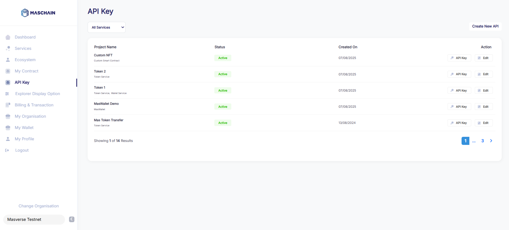
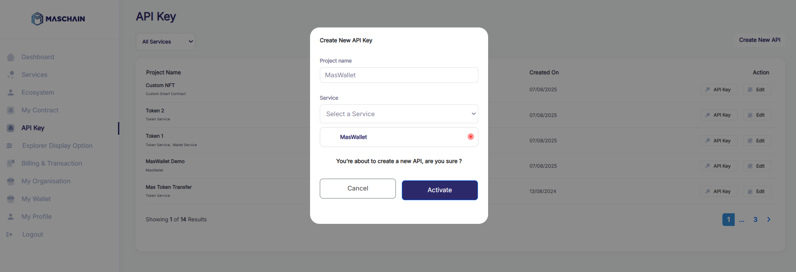
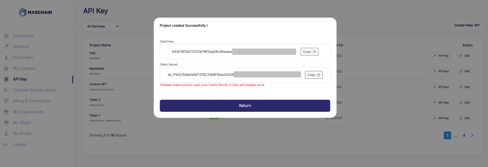

# Getting Started with MasWallet Integration

## 1. Log in to MasChain Enterprise Portal

1. Go to MasChain Enterprise Portal [Mainnet](https://portal.maschain.com/login) or [Testnet](https://portal-testnet.maschain.com/login).
2. Sign in with your enterprise portal account.
3. Navigate to **API Key**.



---

## 2. Generate an API Key

1. Click **Create New API**.
2. Add a **Project Name**.
3. Select **MasWallet** in the **Service** dropdown box.
4. Click **Activate**.

You will receive:

- `Client Key`
- `Client Secret`

> Store these credentials securely. Once Client Secret is lost, you will not able to recover the keys and are required to create a new API key.




---

## 3. Start Integrating!

```jsx title="Initialize the client"
const client = new ApiClient({
  apiClientId: '<YOUR_API_KEY>',
  apiClientSecret: '<YOUR_API_SECRET>',
  baseUrl: 'https://wallet-api.maschain.com', // Optional: defaults to MasWallet's official base URL
});
```

---

## 4. MasWallet SDK Documentation

To integrate MasWallet programmatically, you can use the official SDK.

### 📦 Node.js SDK

You can find the MasWallet Node.js SDK on npm:

👉 [MasWallet-NodeJS on NPM](https://www.npmjs.com/package/maswallet-nodejs)

Use this SDK to:

- Authenticate users with MasWallet
- Interact with wallet APIs
- Request and sign blockchain transactions

Make sure to check the README on NPM for installation instructions, usage examples, and API references.
