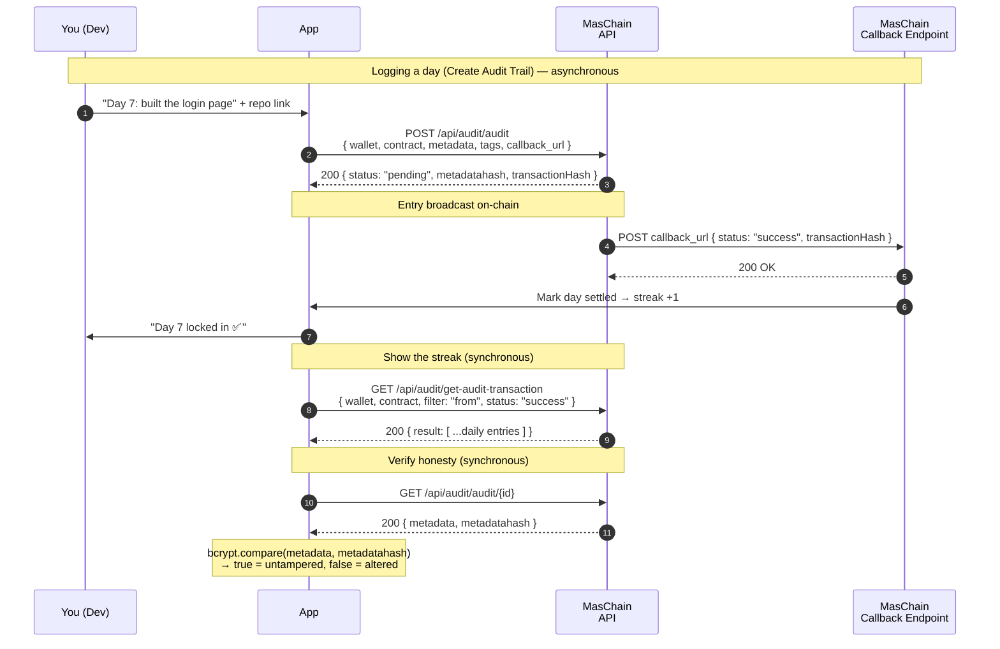

# Code Streak

Every day you code, you post `#100DaysOfCode` on X — but anyone can fake a
streak by backdating a pile of posts the night before. This guide builds a tiny
Node.js app that logs each day's progress to an **on-chain audit trail**:
**tamper-proof, timestamped, and impossible to fake after the fact**. At the end
you get a "verify my streak" script that proves every entry is real and
unchanged.

## The Problem

A streak only means something if it's honest. Screenshots get edited, dates get
faked, and "trust me, I coded every day" is worth nothing to a recruiter looking
at your GitHub. What if each day's entry carried a **cryptographic timestamp**
nobody — not even you — could alter later?

That's exactly what an audit trail gives you. Each entry stores a hash of your
data on-chain with the exact time it was recorded. Change a single character
afterwards and the hash no longer matches — **tampering is detectable by anyone**.

## What You'll Build

A minimal "streak logger" backend that:

- Creates an **audit trail contract** once, at setup,
- Gives you a **wallet** that signs your entries,
- **Logs** one tamper-proof record per day (what you built, your repo link),
- Organises entries with a **category** and **tags** (e.g. `frontend`, `shipped`),
- **Lists** your whole streak on demand,
- **Verifies** any entry's data against its on-chain hash — the honesty check,
- Receives the **asynchronous result** of each write on a callback URL.

## Services Used

- **[Audit Trail](../services/audit-trail/overview.md)** — record each day's progress as a tamper-proof, timestamped entry on-chain.
- **[Wallet Management](../services/wallet-management/overview.md)** — create the wallet that signs your audit entries.

Here is the sequence we are building during this tutorial:



Writes (logging a day) are **asynchronous**: the API immediately returns a
`pending` transaction hash plus the `metadatahash`, then POSTs the final
`success`/`failed` result to your `callback_url`. Reads (listing, verifying)
return synchronously.

---

## Preparation

### 1. Subscribe and get your API keys

In the [Enterprise Portal](https://portal-testnet.maschain.com), subscribe to
**Audit Trail** and **Wallet Management**, then create an API key. You'll receive
a **`client_id`** and **`client_secret`** — these authenticate every request. See
[Calling APIs](../general/calling_apis.md) and
[API Keys Generation](../portal/create-api-keys.md).

### 2. Create the Audit Trail Contract

Create an **Audit Trail smart contract** — this is the ledger your daily entries
are written to. Leave `encrypt_data` as `false` so entries stay publicly readable
(the whole point is that anyone can verify them). You receive a
**`contract_address`**.

You can do this in the portal, or via the API:

```js title="Create the audit contract (one-time)"
// POST /api/audit/contracts
{
  "name": "100DaysOfCode",
  "field": { "encrypt_data": false },
  "callback_url": "https://your.domain/callback"
}
```

The response is `pending`; the `contract_address` is confirmed on the `success`
callback. See
[Audit Trail → Create Smart Contract](../services/audit-trail/audit-trail.md)
and [Smart Contract Creation](../portal/create-smart-contract.md).

### 3. Set up the Project

You need Node.js 18+ (for the built-in `fetch`) and one small library to verify
hashes later. Put your credentials in an `.env` file — never hard-code them:

```bash title=".env"
MASCHAIN_API_URL=https://service-testnet.maschain.com
MASCHAIN_CLIENT_ID=your_client_id
MASCHAIN_CLIENT_SECRET=your_client_secret

# From step 2:
AUDIT_CONTRACT=0x<audit_contract_address>
# The wallet that signs your entries (created in step 1 of the guide):
LOGGER_WALLET=0x<your_wallet_address>
# Where MasChain POSTs async results:
CALLBACK_URL=https://your.domain/callback
```

```bash
npm install express dotenv bcryptjs
```

:::tip Testnet vs Mainnet
Use `https://service-testnet.maschain.com` while developing. Switch to
`https://service.maschain.com` for production. Explore your entries at
[explorer-testnet.maschain.com](https://explorer-testnet.maschain.com).
:::

---

## MasChain Client

Every call hits the same base URL with the same auth headers, so wrap that once
and reuse it:

```js title="maschain.js"
const BASE_URL = process.env.MASCHAIN_API_URL;

const HEADERS = {
  client_id: process.env.MASCHAIN_CLIENT_ID,
  client_secret: process.env.MASCHAIN_CLIENT_SECRET,
  'content-type': 'application/json',
};

// POST helper — returns `result`, throws on any non-200 status.
async function post(path, body) {
  const res = await fetch(`${BASE_URL}${path}`, {
    method: 'POST',
    headers: HEADERS,
    body: JSON.stringify(body),
  });
  const json = await res.json();
  if (json.status !== 200) throw new Error(`MasChain error: ${JSON.stringify(json)}`);
  return json.result;
}

// GET helper — appends query params.
async function get(path, params = {}) {
  const url = new URL(`${BASE_URL}${path}`);
  for (const [k, v] of Object.entries(params)) url.searchParams.set(k, v);
  const res = await fetch(url, { headers: HEADERS });
  const json = await res.json();
  if (json.status !== 200) throw new Error(`MasChain error: ${JSON.stringify(json)}`);
  return json.result;
}

module.exports = { post, get };
```

---

## 1. Create Your Logger Wallet

Create one wallet — it signs every entry you log. The returned
**`wallet_address`** is what appears as the author (`from`) of each record:

```js title="streak.js"
const { post, get } = require('./maschain');

// POST /api/wallet/create-user
async function createLoggerWallet({ name, email, ic }) {
  const result = await post('/api/wallet/create-user', { name, email, ic });
  return result.wallet.wallet_address; // 0x...
}
```

Save the returned address as `LOGGER_WALLET` in your `.env`. See
[Wallet Management → Create User Wallet](../services/wallet-management/wallet.md).

## 2. Organise with a Category and Tags (optional, one-time)

Categories and tags make your streak easy to slice later — "show me every day I
shipped something" or "every day I fought a bug". Create them once and reuse the
returned IDs:

```js title="streak.js"
// POST /api/audit/category  → { id, name, ... }
async function createCategory(name) {
  const result = await post('/api/audit/category', { name });
  return result.id;
}

// POST /api/audit/tag  → { id, name, ... }
async function createTag(name) {
  const result = await post('/api/audit/tag', { name });
  return result.id;
}
```

For example: one category `100DaysOfCode`, and tags like `frontend`, `backend`,
`bug`, `shipped`. See
[Audit Category](../services/audit-trail/audit-category.md) and
[Audit Tags](../services/audit-trail/audit-tags.md).

## 3. Log Today's Progress (create audit trail)

The heart of the app. Each day, write one record. The `metadata` is whatever you
want to prove — keep it as a JSON string so it hashes deterministically. The
response is `pending` and already includes the `metadatahash`; the final outcome
arrives at your callback:

```js title="streak.js"
// POST /api/audit/audit
async function logDay({ day, summary, repo, categoryId, tagIds }) {
  // Serialise once so the exact same string is what gets hashed and stored.
  const metadata = JSON.stringify({ day, summary, repo });

  return post('/api/audit/audit', {
    wallet_address: process.env.LOGGER_WALLET,
    contract_address: process.env.AUDIT_CONTRACT,
    metadata,
    category_id: categoryId ? [categoryId] : [],
    tag_id: tagIds || [],
    callback_url: process.env.CALLBACK_URL,
  });
}
```

```js title="Sample result (immediate)"
{
  "status": 200,
  "result": {
    "transactionHash": "0x76578bb22a17d1fa06165570...",
    "nonce": 175,
    "status": "pending",
    "metadatahash": "$2y$12$JCdgqkB1QKI5cRHTVaQXqu2JZPMj5MH8qT6GU7vb0NR4ONjgR1i62",
    "metadata": "{\"day\":7,\"summary\":\"built the login page\",\"repo\":\"...\"}",
    "from": "0x44Ce5799F1d0672e6577..."
  }
}
```

That `metadatahash` is the magic — a salted hash of your exact data, anchored
on-chain. Hold onto the entry until the callback confirms it.

## 4. Show Your Streak (list entries)

Reads return synchronously — no callback needed. List every confirmed entry your
wallet has written:

```js title="streak.js"
// GET /api/audit/get-audit-transaction
async function getStreak() {
  return get('/api/audit/get-audit-transaction', {
    wallet_address: process.env.LOGGER_WALLET,
    contract_address: process.env.AUDIT_CONTRACT,
    filter: 'from',        // entries authored by you
    status: 'success',     // only confirmed days count
  });
}
```

```js title="Sample result"
{
  "status": 200,
  "result": [
    {
      "from": "0x44Ce5799F1d0672e6577C4F0038729177dB65FD7",
      "status": "success",
      "blockNumber": 8717499,
      "transactionHash": "0x899bcb62f70b9ac51da499f0bcdebbf4ec528ed37cc00596c4598b1e0ec42d6c",
      "method": "mint",
      "timestamp": "2025-09-11T04:16:05.000000Z",
      "metadata": "{\"day\":7,\"summary\":\"built the login page\",\"repo\":\"...\"}"
    }
  ]
}
```

`result.length` is your streak. Each `timestamp` is the on-chain proof of *when*
you logged that day — no backdating possible.

## 5. Verify Honesty (the tamper check)

This is the payoff. Fetch any single entry and check its stored `metadata`
against the on-chain `metadatahash`. Because the hash is anchored on-chain, a
match proves the data is exactly what you committed that day — and a mismatch
proves someone edited it:

```js title="streak.js"
const bcrypt = require('bcryptjs');

// GET /api/audit/audit/{id}
async function verifyEntry(id) {
  const entry = await get(`/api/audit/audit/${id}`);
  const untampered = bcrypt.compareSync(entry.metadata, entry.metadatahash);
  return { id, untampered, metadata: entry.metadata };
}
```

```js title="Verify output"
{ id: 439, untampered: true, metadata: '{"day":7,"summary":"built the login page","repo":"..."}' }
```

Try it: change one character of the stored `metadata` and re-run — `untampered`
flips to `false`. That's a proof anyone can reproduce, which is what makes the
streak trustworthy.

## 6. Receive Async Result (Callback)

Logging a day finishes out-of-band. Stand up an endpoint at your `CALLBACK_URL`
to record the outcome — this is where you confirm the day was actually written
before counting it toward your streak:

```js title="callback-server.js"
const express = require('express');
const app = express();
app.use(express.json());

// MasChain POSTs the final transaction result here.
app.post('/callback', (req, res) => {
  const { status, transactionHash } = req.body;

  if (status === 'success') {
    // Mark the day as settled, increment the streak, celebrate.
    console.log(`✅ ${transactionHash} confirmed — streak +1`);
  } else {
    // status === 'failed' — the day didn't record; prompt a retry.
    console.log(`❌ ${transactionHash} failed: ${req.body.message}`);
  }

  res.sendStatus(200); // acknowledge receipt
});

app.listen(3000, () => console.log('Listening for MasChain callbacks on :3000'));
```

```js title="Sample callback (success)"
{
  "status": "success",
  "from": "0x1a0BA2b4d8830496Beb8469...",
  "nonce": 129,
  "transactionHash": "0xf519ba69ba0e603583e0e885786f5ad1...",
  "receipt": { }
}
```

:::warning Count a day only on `success`
The immediate API response is only `pending`. Wait for a `success` callback
before adding the day to your streak. On `failed`, don't count it — surface the
error and retry. See the callback shapes in the
[Audit Trail reference](../services/audit-trail/audit-trail.md).
:::

---

## Putting It Together

```js title="demo.js"
require('dotenv').config();
const {
  createCategory, createTag, logDay, getStreak, verifyEntry,
} = require('./streak');

(async () => {
  // One-time setup (do this once, then hard-code the IDs)
  const categoryId = await createCategory('100DaysOfCode');
  const shipped = await createTag('shipped');

  // Log today
  const entry = await logDay({
    day: 7,
    summary: 'Built the login page and wired up auth',
    repo: 'https://github.com/you/your-project',
    categoryId,
    tagIds: [shipped],
  });
  console.log('Logged (pending):', entry.transactionHash);

  // ...after the success callback, check your streak
  const streak = await getStreak();
  console.log(`🔥 Current streak: ${streak.length} days`);

  // Prove day 7 is honest
  console.log(await verifyEntry(439));
})();
```

Run it:

```bash
node demo.js
```

Watch each entry confirm in the
[MasChain Explorer](https://explorer-testnet.maschain.com), and your
`callback-server.js` log the `success` result. When you hit day 100, your streak
isn't a claim — it's a chain of proofs.

## Next steps

- [Audit Trail Overview](../services/audit-trail/overview.md)
- [Audit Trail Reference](../services/audit-trail/audit-trail.md) — full request/response and callback details
- [Audit Category](../services/audit-trail/audit-category.md) and [Audit Tags](../services/audit-trail/audit-tags.md) — organise your entries
- [Wallet Management Overview](../services/wallet-management/overview.md)
- [Calling APIs](../general/calling_apis.md) — authentication basics
