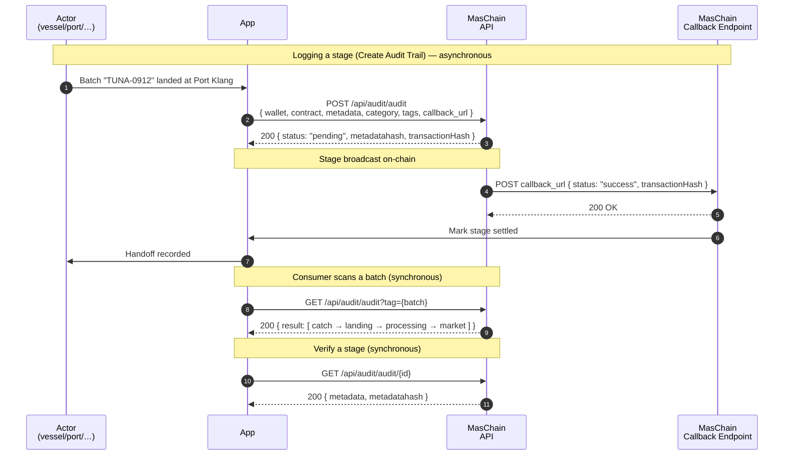

# Fishery Tracker

"Sustainably caught" is printed on a lot of seafood, but the journey from the
boat to your plate passes through several hands and almost none of it is
checkable. This guide builds a small Node.js app that records **every handoff of
a catch** on-chain — vessel, landing, processor, market — so a buyer can scan one
code and see the whole story, tamper-proof.

## The Problem

Seafood has one of the murkiest supply chains in food. Catches get mislabelled,
illegally-caught fish gets laundered into legal shipments, and consumers have no
way to tell. If each **stage of custody** were logged as an un-editable,
timestamped record, the chain becomes a verifiable story instead of a marketing
claim.

An audit trail gives you exactly that. Each handoff stores a hash of the catch
data on-chain with the exact time. Alter a species, a weight, or a date after the
fact and the hash no longer matches — **the tampering is caught**.

## What You'll Build

A minimal "catch tracker" backend that:

- Creates an **audit trail contract** once, at setup,
- Gives each actor (**vessel, port, processor, market**) a **wallet**,
- **Records a catch** at sea with species, weight, and zone,
- **Logs each handoff** down the chain as a new stage,
- Organises records with **categories** (stage) and **tags** (species / vessel),
- Rebuilds the **full journey** of one catch batch for a consumer,
- **Verifies** each stage against its on-chain hash,
- Receives the **asynchronous result** of each write on a callback URL.

## Services Used

- **[Audit Trail](../services/audit-trail/overview.md)** — record each stage of custody as a tamper-proof, timestamped entry.
- **[Wallet Management](../services/wallet-management/overview.md)** — give each actor in the chain a wallet that signs their handoff.

Here is the sequence we are building during this tutorial:



Writes (each handoff) are **asynchronous**: the API returns a `pending` hash plus
the `metadatahash` immediately, then POSTs the final `success`/`failed` result to
your `callback_url`. Reads return synchronously.

---

## Preparation

### 1. Subscribe and get your API keys

In the [Enterprise Portal](https://portal-testnet.maschain.com), subscribe to
**Audit Trail** and **Wallet Management**, then create an API key for your
**`client_id`** and **`client_secret`**. See
[Calling APIs](../general/calling_apis.md) and
[API Keys Generation](../portal/create-api-keys.md).

### 2. Create the Audit Trail Contract

Create an **Audit Trail smart contract** — the shared ledger every actor writes
to. Keep `encrypt_data` as `false` so a consumer can verify records publicly. You
receive a **`contract_address`**.

```js title="Create the audit contract (one-time)"
// POST /api/audit/contracts
{
  "name": "FisheryTracker",
  "field": { "encrypt_data": false },
  "callback_url": "https://your.domain/callback"
}
```

See [Audit Trail → Create Smart Contract](../services/audit-trail/audit-trail.md).

### 3. Set up the Project

Node.js 18+ (for the built-in `fetch`) and `bcryptjs` for verification. Keep
credentials in `.env`:

```bash title=".env"
MASCHAIN_API_URL=https://service-testnet.maschain.com
MASCHAIN_CLIENT_ID=your_client_id
MASCHAIN_CLIENT_SECRET=your_client_secret

# From step 2:
AUDIT_CONTRACT=0x<audit_contract_address>
# Where MasChain POSTs async results:
CALLBACK_URL=https://your.domain/callback
```

```bash
npm install express dotenv bcryptjs
```

:::tip Testnet vs Mainnet
Develop on `https://service-testnet.maschain.com`; switch to
`https://service.maschain.com` for production. Explore records at
[explorer-testnet.maschain.com](https://explorer-testnet.maschain.com).
:::

---

## MasChain Client

Same base URL and auth headers everywhere, so wrap them once:

```js title="maschain.js"
const BASE_URL = process.env.MASCHAIN_API_URL;

const HEADERS = {
  client_id: process.env.MASCHAIN_CLIENT_ID,
  client_secret: process.env.MASCHAIN_CLIENT_SECRET,
  'content-type': 'application/json',
};

async function post(path, body) {
  const res = await fetch(`${BASE_URL}${path}`, {
    method: 'POST', headers: HEADERS, body: JSON.stringify(body),
  });
  const json = await res.json();
  if (json.status !== 200) throw new Error(`MasChain error: ${JSON.stringify(json)}`);
  return json.result;
}

async function get(path, params = {}) {
  const url = new URL(`${BASE_URL}${path}`);
  for (const [k, v] of Object.entries(params)) url.searchParams.set(k, v);
  const res = await fetch(url, { headers: HEADERS });
  const json = await res.json();
  if (json.status !== 200) throw new Error(`MasChain error: ${JSON.stringify(json)}`);
  return json.result;
}

module.exports = { post, get };
```

---

## 1. Give Each Actor a Wallet

Each link in the chain signs its own handoff, so the `from` address on every
record shows *who* did it. Create a wallet per actor:

```js title="fishery.js"
const { post, get } = require('./maschain');

// POST /api/wallet/create-user
async function createActorWallet({ name, email, ic }) {
  const result = await post('/api/wallet/create-user', { name, email, ic });
  return result.wallet.wallet_address; // 0x...
}
```

Create one for the vessel, the port, the processor, and the market. See
[Wallet Management → Create User Wallet](../services/wallet-management/wallet.md).

## 2. Set up Stages and Batch Tags (one-time)

Use a **category** for the stage of custody and a **tag** for the batch ID — the
tag is what a consumer scans to pull the whole journey:

```js title="fishery.js"
async function createCategory(name) {
  return (await post('/api/audit/category', { name })).id;   // POST /api/audit/category
}
async function createTag(name) {
  return (await post('/api/audit/tag', { name })).id;        // POST /api/audit/tag
}
```

Categories `Catch`, `Landing`, `Processing`, `Market`; one tag per batch such as
`TUNA-0912`. See [Audit Category](../services/audit-trail/audit-category.md) and
[Audit Tags](../services/audit-trail/audit-tags.md).

## 3. Log a Stage of Custody

The core action, called once per handoff. The signing `wallet_address` is the
actor doing the handoff; the batch tag ties the stages together:

```js title="fishery.js"
// POST /api/audit/audit
async function logStage({ actorWallet, batch, stage, details, categoryId, batchTagId }) {
  const metadata = JSON.stringify({
    entity_id: batch,   // e.g. "TUNA-0912" — shared across every stage
    stage,              // "catch" | "landing" | "processing" | "market"
    ...details,         // species, weightKg, zone, temperatureC, etc.
  });

  return post('/api/audit/audit', {
    wallet_address: actorWallet,
    contract_address: process.env.AUDIT_CONTRACT,
    metadata,
    category_id: categoryId ? [categoryId] : [],
    tag_id: batchTagId ? [batchTagId] : [],
    callback_url: process.env.CALLBACK_URL,
  });
}
```

```js title="Sample result (immediate)"
{
  "status": 200,
  "result": {
    "transactionHash": "0x76578bb22a17d1fa06165570...",
    "status": "pending",
    "metadatahash": "$2y$12$JCdgqkB1QKI5cRHTVaQXqu2JZPMj5MH8qT6GU7vb0NR4ONjgR1i62",
    "metadata": "{\"entity_id\":\"TUNA-0912\",\"stage\":\"catch\",...}"
  }
}
```

## 4. Rebuild a Catch's Journey

When a consumer scans a batch code, pull every record tagged with that batch and
sort by time to show the full boat-to-plate story:

```js title="fishery.js"
// GET /api/audit/audit?tag={id}
async function getJourney(batchTagId) {
  const records = await get('/api/audit/audit', { tag: batchTagId });
  return records
    .map((r) => ({ ...r, data: JSON.parse(r.metadata) }))
    .sort((a, b) => new Date(a.created_at) - new Date(b.created_at));
}
```

Each record's `created_at` and `transactionHash` are the un-editable proof of
*when* and *where* that stage happened — catch at sea, landing at port,
processing, market.

## 5. Verify a Stage

The trust check. Fetch a record and compare its stored `metadata` against the
on-chain `metadatahash`:

```js title="fishery.js"
const bcrypt = require('bcryptjs');

// GET /api/audit/audit/{id}
async function verifyStage(id) {
  const entry = await get(`/api/audit/audit/${id}`);
  return { id, untampered: bcrypt.compareSync(entry.metadata, entry.metadatahash) };
}
```

Try changing a recorded weight or species and re-run — `untampered` flips to
`false`. That's how a mislabelled or laundered catch gets exposed.

## 6. Receive Async Result (Callback)

Writes finish out-of-band. Stand up an endpoint at your `CALLBACK_URL` to confirm
each handoff before advancing the batch to its next stage:

```js title="callback-server.js"
const express = require('express');
const app = express();
app.use(express.json());

app.post('/callback', (req, res) => {
  const { status, transactionHash } = req.body;
  if (status === 'success') {
    console.log(`${transactionHash} confirmed`);
  } else {
    console.log(`${transactionHash} failed: ${req.body.message}`);
  }
  res.sendStatus(200);
});

app.listen(3000, () => console.log('Listening for MasChain callbacks on :3000'));
```

:::warning Advance a batch only on `success`
The immediate response is only `pending`. Wait for the `success` callback before
handing the batch to the next actor. On `failed`, don't advance — retry.
:::

---

## Putting It Together

```js title="demo.js"
require('dotenv').config();
const { createCategory, createTag, logStage, getJourney } = require('./fishery');

(async () => {
  // One-time setup
  const catchStage = await createCategory('Catch');
  const landing = await createCategory('Landing');
  const batch = await createTag('TUNA-0912');

  // Vessel logs the catch at sea
  await logStage({
    actorWallet: process.env.VESSEL_WALLET, batch: 'TUNA-0912', stage: 'catch',
    details: { species: 'Yellowfin Tuna', weightKg: 240, zone: 'FAO-71' },
    categoryId: catchStage, batchTagId: batch,
  });

  // Port logs the landing
  await logStage({
    actorWallet: process.env.PORT_WALLET, batch: 'TUNA-0912', stage: 'landing',
    details: { port: 'Port Klang', temperatureC: 2 },
    categoryId: landing, batchTagId: batch,
  });

  // ...after the success callbacks, rebuild the journey a consumer would see
  const journey = await getJourney(batch);
  journey.forEach((s) => console.log(`${s.data.stage} → ${s.created_at}`));
})();
```

Run it:

```bash
node demo.js
```

Watch each handoff confirm in the
[MasChain Explorer](https://explorer-testnet.maschain.com). "Sustainably caught"
stops being a sticker and becomes a chain of proofs a buyer can check.

## Next steps

- [Audit Trail Overview](../services/audit-trail/overview.md)
- [Audit Trail Reference](../services/audit-trail/audit-trail.md) — full request/response and callback details
- [Audit Category](../services/audit-trail/audit-category.md) and [Audit Tags](../services/audit-trail/audit-tags.md)
- [Wallet Management Overview](../services/wallet-management/overview.md)
- [Calling APIs](../general/calling_apis.md) — authentication basics
