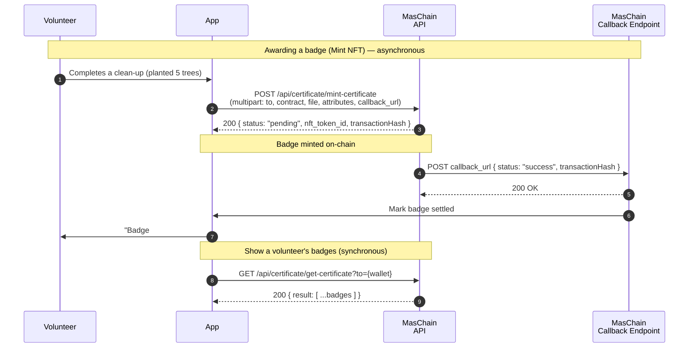

# Green Badges

Companies and student clubs run "green" CSR drives — beach clean-ups,
tree-planting, recycling days — but the reward is usually a paper certificate
that goes in the bin. This guide builds a small Node.js app that mints a
**collectible NFT badge** to each volunteer: a verifiable, un-fakeable proof of
what they contributed that lives in their wallet forever.

## The Problem

Recognition for volunteering is forgettable and easy to fake — a PDF anyone can
edit, a LinkedIn line nobody can check. A **non-fungible token** flips that: each
badge is unique, owned by the volunteer's wallet, and carries on-chain
**attributes** (trees planted, kg recycled, CO₂ offset) that a recruiter or
sponsor can verify independently. It's a reward people actually keep.

## What You'll Build

A minimal "green badge" backend that:

- Creates an **NFT contract** for your CSR programme once, at setup,
- Gives each volunteer a **wallet** to hold badges,
- **Mints** a badge NFT with an image and impact attributes,
- Lets volunteers **hold and show** their badge collection,
- Optionally **transfers** a badge between wallets,
- Receives the **asynchronous result** of each mint on a callback URL.

## Services Used

- **[Certificate (NFT)](../services/certificate/overview.md)** — Mint each CSR reward as a unique, verifiable NFT badge.
- **[Wallet Management](../services/wallet-management/overview.md)** — Give each volunteer a wallet to hold their badges.

Here is the sequence we are building during this tutorial:



Minting is **asynchronous**: the API returns a `pending` result with the
`nft_token_id` immediately, then POSTs the final `success`/`failed` result to your
`callback_url`. Reads return synchronously.

---

## Preparation

### 1. Subscribe and get your API keys

In the [Enterprise Portal](https://portal-testnet.maschain.com), subscribe to
**Certificate** and **Wallet Management**, then create an API key for your
**`client_id`** and **`client_secret`**. See
[Calling APIs](../general/calling_apis.md) and
[API Keys Generation](../portal/create-api-keys.md).

### 2. Create the Badge NFT Contract

Create an **NFT smart contract** for your programme — this is the collection your
badges belong to. The `wallet_address_owner` you set is the **only wallet allowed
to mint**, so use a wallet you control. You receive a **`contract_address`**.

```js title="Create the NFT contract (one-time)"
// POST /api/certificate/create-smartcontract
{
  "wallet_address": "0x<owner_wallet>",      // deploys the contract
  "name": "GoGreenBadges",                   // contract nickname
  "field": {
    "wallet_address_owner": "0x<owner_wallet>", // ONLY this wallet can mint
    "max_supply": 0,                            // 0 = unlimited
    "name": "GoGreen Badge",
    "symbol": "GREEN"
  },
  "callback_url": "https://your.domain/callback"
}
```

The `contract_address` is confirmed on the `success` callback. See
[Certificate → Create Smart Contract](../services/certificate/certificate-service.md)
and [Smart Contract Creation](../portal/create-smart-contract.md).

### 3. Set up the Project

Node.js 18+ (for the built-in `fetch`, `FormData`, and `Blob`). Keep credentials
in `.env`:

```bash title=".env"
MASCHAIN_API_URL=https://service-testnet.maschain.com
MASCHAIN_CLIENT_ID=your_client_id
MASCHAIN_CLIENT_SECRET=your_client_secret

# From step 2:
BADGE_CONTRACT=0x<nft_contract_address>
# The contract owner — the only wallet allowed to mint:
OWNER_WALLET=0x<owner_wallet>
# Where MasChain POSTs async results:
CALLBACK_URL=https://your.domain/callback
```

```bash
npm install express dotenv
```

:::tip Testnet vs Mainnet
Develop on `https://service-testnet.maschain.com`; switch to
`https://service.maschain.com` for production. View badges at
[explorer-testnet.maschain.com](https://explorer-testnet.maschain.com).
:::

---

## MasChain Client

Reads and the contract call use JSON; minting a badge uploads a file, so it needs
a `multipart/form-data` helper. Note the form helper does **not** set a
`content-type` — `fetch` sets the multipart boundary automatically:

```js title="maschain.js"
const fs = require('fs');
const BASE_URL = process.env.MASCHAIN_API_URL;

const AUTH = {
  client_id: process.env.MASCHAIN_CLIENT_ID,
  client_secret: process.env.MASCHAIN_CLIENT_SECRET,
};

async function post(path, body) {
  const res = await fetch(`${BASE_URL}${path}`, {
    method: 'POST',
    headers: { ...AUTH, 'content-type': 'application/json' },
    body: JSON.stringify(body),
  });
  const json = await res.json();
  if (json.status !== 200) throw new Error(`MasChain error: ${JSON.stringify(json)}`);
  return json.result;
}

// multipart/form-data POST — for endpoints that upload a file.
async function postForm(path, fields, filePath) {
  const form = new FormData();
  for (const [k, v] of Object.entries(fields)) form.set(k, v);
  const bytes = fs.readFileSync(filePath);
  form.set('file', new Blob([bytes]), filePath.split('/').pop());

  const res = await fetch(`${BASE_URL}${path}`, { method: 'POST', headers: AUTH, body: form });
  const json = await res.json();
  if (json.status !== 200) throw new Error(`MasChain error: ${JSON.stringify(json)}`);
  return json.result;
}

async function get(path, params = {}) {
  const url = new URL(`${BASE_URL}${path}`);
  for (const [k, v] of Object.entries(params)) url.searchParams.set(k, v);
  const res = await fetch(url, { headers: AUTH });
  const json = await res.json();
  if (json.status !== 200) throw new Error(`MasChain error: ${JSON.stringify(json)}`);
  return json.result;
}

module.exports = { post, postForm, get };
```

---

## 1. Give Each Volunteer a Wallet

Each volunteer needs a wallet to receive and hold badges. The returned
**`wallet_address`** is where their NFTs live:

```js title="gogreen.js"
const { post, postForm, get } = require('./maschain');

// POST /api/wallet/create-user
async function createVolunteerWallet({ name, email, ic }) {
  const result = await post('/api/wallet/create-user', { name, email, ic });
  return result.wallet.wallet_address; // 0x...
}
```

See [Wallet Management → Create User Wallet](../services/wallet-management/wallet.md).

## 2. Mint a Badge

The core action. Mint from the **owner** wallet to the volunteer's wallet,
attaching a badge image and the impact as `attributes`. Minting is a file upload,
so use the `postForm` helper:

```js title="gogreen.js"
// POST /api/certificate/mint-certificate  (multipart/form-data)
async function awardBadge({ volunteerWallet, title, description, attributes, imagePath }) {
  return postForm('/api/certificate/mint-certificate', {
    wallet_address: process.env.OWNER_WALLET,     // must be the contract owner
    to: volunteerWallet,                          // volunteer receiving the badge
    contract_address: process.env.BADGE_CONTRACT,
    name: title,                                  // "Beach Clean-up 2026"
    description,
    attributes: JSON.stringify(attributes),       // impact metrics
    callback_url: process.env.CALLBACK_URL,
  }, imagePath);
}
```

```js title="Sample result (immediate)"
{
  "status": 200,
  "result": {
    "nft_token_id": 17,
    "transactionHash": "0xf519ba69ba0e603583e0e885786f5ad1...",
    "receiver_wallet_address": "0x147f20a28739da15419AdC0...",
    "certificate": "https://storage.maschain.com/.../metadata/17.json",
    "certificate_image": "https://storage.maschain.com/.../image/badge.png",
    "status": "pending"
  }
}
```

The `attributes` are what make the badge verifiable — for example:

```js title="attributes example"
[
  { "trait": "Activity", "value": "Tree Planting" },
  { "trait": "Trees Planted", "value": "5" },
  { "trait": "CO2 Offset (kg)", "value": "110" },
  { "trait": "Date", "value": "2026-07-05" }
]
```

For larger images, use `mint-certificate-small` / `-medium` / `-large` (up to
10 / 30 / 100 MB). See
[Certificate → Mint NFT](../services/certificate/certificate-service.md).

## 3. Show a Volunteer's Badge Collection

Reads are synchronous. Pull every badge a wallet has received:

```js title="gogreen.js"
// GET /api/certificate/get-certificate
async function getBadges(volunteerWallet) {
  return get('/api/certificate/get-certificate', {
    to: volunteerWallet,
    contract_address: process.env.BADGE_CONTRACT,
    status: 'success',
  });
}
```

Each entry includes the `nft_token_id`, `transactionHash`, and the token's
`certificate` metadata URL — a public, verifiable record of the volunteer's
contribution.

## 4. Transfer a Badge (optional)

Because it's a real NFT, a badge can move between wallets — handy if a volunteer
migrates to a personal wallet:

```js title="gogreen.js"
// POST /api/certificate/transfer
async function transferBadge({ fromWallet, toWallet, nftId }) {
  return post('/api/certificate/transfer', {
    wallet_address: fromWallet,
    to: toWallet,
    nft_id: String(nftId),
    contract_address: process.env.BADGE_CONTRACT,
    callback_url: process.env.CALLBACK_URL,
  });
}
```

## 5. Receive Async Result (Callback)

Minting finishes out-of-band. Stand up an endpoint at your `CALLBACK_URL` to
confirm the badge actually minted before telling the volunteer:

```js title="callback-server.js"
const express = require('express');
const app = express();
app.use(express.json());

app.post('/callback', (req, res) => {
  const { status, transactionHash } = req.body.result || req.body;
  if (status === 'success') {
    console.log(`${transactionHash} confirmed — badge minted`);
  } else {
    console.log(`${transactionHash} failed: ${req.body.result?.message}`);
  }
  res.sendStatus(200);
});

app.listen(3000, () => console.log('Listening for MasChain callbacks on :3000'));
```

:::warning Announce a badge only on `success`
The immediate response is only `pending`. Wait for the `success` callback before
telling the volunteer their badge is live. On `failed`, don't announce it — retry.
:::

---

## Putting It Together

```js title="demo.js"
require('dotenv').config();
const { createVolunteerWallet, awardBadge, getBadges } = require('./gogreen');

(async () => {
  // Onboard a volunteer
  const wallet = await createVolunteerWallet({
    name: 'Amir', email: 'amir@example.com', ic: '030101-01-1234',
  });
  console.log('Volunteer wallet:', wallet);

  // Award a badge for a tree-planting drive
  const badge = await awardBadge({
    volunteerWallet: wallet,
    title: 'Tree Planting Drive 2026',
    description: 'Planted 5 trees at the Bukit reforestation site.',
    attributes: [
      { trait: 'Activity', value: 'Tree Planting' },
      { trait: 'Trees Planted', value: '5' },
      { trait: 'CO2 Offset (kg)', value: '110' },
    ],
    imagePath: './badge.png',
  });
  console.log('Minted (pending):', badge.nft_token_id);

  // ...after the success callback, show their collection
  console.log('Badges:', await getBadges(wallet));
})();
```

Run it:

```bash
node demo.js
```

Watch each badge mint in the
[MasChain Explorer](https://explorer-testnet.maschain.com), and your
`callback-server.js` log the `success` result. Volunteers walk away with a
collectible they own — not a certificate they'll lose.

## Next steps

- [Certificate (NFT) Overview](../services/certificate/overview.md)
- [Certificate Service Reference](../services/certificate/certificate-service.md) — full request/response and callback details
- [Wallet Management Overview](../services/wallet-management/overview.md)
- [Calling APIs](../general/calling_apis.md) — authentication basics
