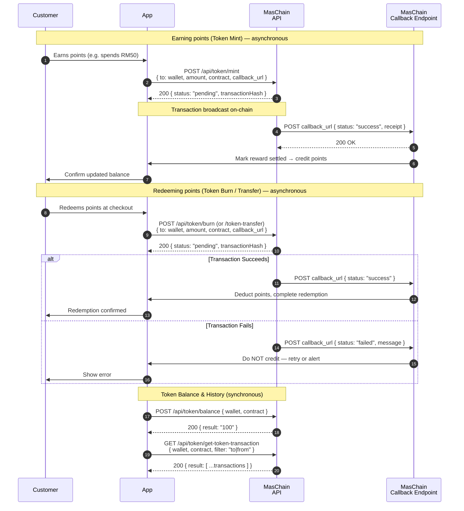

# Loyalty & Rewards Points

Build a working loyalty programme where every point is an on-chain token —
**transparent, portable, and tamper-proof**. This guide walks you end-to-end,
from an empty project to a small Node.js app that mints points when customers
earn them, burns points when they redeem, and shows a verifiable balance.

## The Problem

You run a loyalty programme and want points customers can trust. Representing
each point as an ERC-20 token — the industry standard for interchangeable
tokens — lets customers hold, transfer, and redeem points with a balance anyone
can verify on-chain, instead of trusting an opaque central ledger.

## What You'll Build

A minimal "Reward Points" backend that:

- Creates a **points token** (an ERC-20 smart contract) once, at setup,
- Gives each customer a **wallet**,
- **Mints** points into a wallet when a customer earns them,
- **Burns** or **transfers** points when they spend them,
- Reads a customer's **balance** and **transaction history** on demand,
- Receives the **asynchronous result** of each transaction on a callback URL.

## Services Used

- **[Token Management](../services/token/overview.md)** — tokenise loyalty points as an ERC-20 token (mint, burn, transfer, balance).
- **[Wallet Management](../services/wallet-management/overview.md)** — create a wallet for each customer to hold their points.

Here is the sequence we are building during this tutorial:



Writes (mint, burn, transfer) are **asynchronous**: the API immediately returns a
`pending` transaction hash, then POSTs the final `success`/`failed` result to your
`callback_url`. Reads (balance, history) return synchronously.

---

## Preparation

### 1. Subscribe and get your API keys

In the [Enterprise Portal](https://portal-testnet.maschain.com), subscribe to
**Token Management** and **Wallet Management**, then create an API key. You'll
receive a **`client_id`** and **`client_secret`** — these authenticate every
request. See [Calling APIs](../general/calling_apis.md) and
[API Keys Generation](../portal/create-api-keys.md).

### 2. Create the Points Token Contract

Create a **Token smart contract** — set the **Token Name** (e.g. `Reward Points`),
**Symbol** (e.g. `RWD`), **Decimals** (`0` for whole points), and **Max Cap**
(`0` for unlimited). You receive a **`contract_address`**.

See [Token Services → Create Smart Contract](../services/token/token-service.md)
and [Smart Contract Creation](../portal/create-smart-contract.md).

### 3. Set up the Project

You only need Node.js 18+ (for the built-in `fetch`). Put your credentials in an
`.env` file — never hard-code them:

```bash title=".env"
MASCHAIN_API_URL=https://service-testnet.maschain.com
MASCHAIN_CLIENT_ID=your_client_id
MASCHAIN_CLIENT_SECRET=your_client_secret

# From step 2:
POINTS_CONTRACT=0x<points_contract>
# The wallet that owns the points contract (the minter/burner):
OWNER_WALLET=0x<contract_owner_wallet>
# Where MasChain POSTs async results:
CALLBACK_URL=https://your.domain/callback
```

:::tip Testnet vs Mainnet
Use `https://service-testnet.maschain.com` while developing. Switch to
`https://service.maschain.com` for production. Explore transactions at
[explorer-testnet.maschain.com](https://explorer-testnet.maschain.com).
:::

---

## MasChain Client

Every call hits the same base URL with the same auth headers, so wrap that once
and reuse it:

```js title="maschain.js"
const BASE_URL = process.env.MASCHAIN_API_URL;

const HEADERS = {
  client_id: process.env.MASCHAIN_CLIENT_ID,
  client_secret: process.env.MASCHAIN_CLIENT_SECRET,
  'content-type': 'application/json',
};

// POST helper — returns `result`, throws on any non-200 status.
async function post(path, body) {
  const res = await fetch(`${BASE_URL}${path}`, {
    method: 'POST',
    headers: HEADERS,
    body: JSON.stringify(body),
  });
  const json = await res.json();
  if (json.status !== 200) throw new Error(`MasChain error: ${JSON.stringify(json)}`);
  return json.result;
}

// GET helper — appends query params.
async function get(path, params = {}) {
  const url = new URL(`${BASE_URL}${path}`);
  for (const [k, v] of Object.entries(params)) url.searchParams.set(k, v);
  const res = await fetch(url, { headers: HEADERS });
  const json = await res.json();
  if (json.status !== 200) throw new Error(`MasChain error: ${JSON.stringify(json)}`);
  return json.result;
}

module.exports = { post, get };
```

---

## 1. Create & Assign Each Customer a Wallet

Create one wallet per customer. The returned **`wallet_address`** is where their
points live. `create-user` also stores the customer's identity alongside the wallet:

```js title="loyalty.js"
const { post, get } = require('./maschain');

// POST /api/wallet/create-user
async function createCustomerWallet({ name, email, ic }) {
  const result = await post('/api/wallet/create-user', { name, email, ic });
  return result.wallet.wallet_address; // 0x...
}
```

```js title="Sample result"
{
  "status": 200,
  "result": {
    "wallet": {
      "wallet_id": 13240,
      "wallet_name": "User 1",
      "wallet_address": "0x815D5e471395db1...",
      "wallet_type": "user",
      "is_active": 1
    }
  }
}
```

See [Wallet Management → Create User Wallet](../services/wallet-management/wallet.md).

## 2. Award Points (mint)

When a customer earns points, **mint** tokens from the owner wallet into the
customer's wallet. The response is `pending`; the final outcome arrives at your
callback:

```js title="loyalty.js"
// POST /api/token/mint
async function awardPoints(customerWallet, amount) {
  return post('/api/token/mint', {
    wallet_address: process.env.OWNER_WALLET,   // contract owner (minter)
    to: customerWallet,                         // customer receiving points
    amount: String(amount),                     // "100"
    contract_address: process.env.POINTS_CONTRACT,
    callback_url: process.env.CALLBACK_URL,
  });
}
```

```js title="Sample result (immediate)"
{
  "status": 200,
  "result": {
    "transactionHash": "0xf519ba69ba0...",
    "nonce": 752,
    "from": "0x147f20a28...",
    "status": "pending"
  }
}
```

## 3. Redeem Points (Burn) or Transfer

When a customer spends points, either **burn** them (they're consumed) or
**transfer** them to another wallet:

```js title="loyalty.js"
// POST /api/token/burn — remove points when spent
async function redeemPoints(customerWallet, amount) {
  return post('/api/token/burn', {
    wallet_address: process.env.OWNER_WALLET,   // contract owner (burner)
    to: customerWallet,                         // wallet holding the points to burn
    amount: String(amount),
    contract_address: process.env.POINTS_CONTRACT,
    callback_url: process.env.CALLBACK_URL,
  });
}

// POST /api/token/token-transfer — move points between wallets
async function transferPoints(fromWallet, toWallet, amount) {
  return post('/api/token/token-transfer', {
    wallet_address: fromWallet,
    to: toWallet,
    amount: String(amount),
    contract_address: process.env.POINTS_CONTRACT,
    callback_url: process.env.CALLBACK_URL,
  });
}
```

## 4. Show Points Balance and History

Reads return synchronously — no callback needed:

```js title="loyalty.js"
// POST /api/token/balance
async function getBalance(customerWallet) {
  return post('/api/token/balance', {
    wallet_address: customerWallet,
    contract_address: process.env.POINTS_CONTRACT,
  });
}

// GET /api/token/get-token-transaction
async function getHistory(customerWallet) {
  return get('/api/token/get-token-transaction', {
    wallet_address: customerWallet,
    contract_address: process.env.POINTS_CONTRACT,
    filter: 'to|from',   // points received and spent
    status: 'success',
  });
}
```

```js title="Sample balance result"
{
    "status": 200, 
    "result": "100" 
}
```

## 5. Receive Async Result (Callback)

Mint, burn, and transfer finish out-of-band. Stand up an endpoint at your
`CALLBACK_URL` to record the outcome — this is where you confirm points were
actually awarded or redeemed before telling the customer:

```js title="callback-server.js"
const express = require('express');
const app = express();
app.use(express.json());

// MasChain POSTs the final transaction result here.
app.post('/callback', (req, res) => {
  const { status, transactionHash } = req.body.result;

  if (status === 'success') {
    // Mark the reward as settled, notify the customer, update your ledger.
    console.log(`✅ ${transactionHash} confirmed`);
  } else {
    // status === 'failed' — do NOT credit the customer; retry or alert.
    console.log(`❌ ${transactionHash} failed: ${req.body.result.message}`);
  }

  res.sendStatus(200); // acknowledge receipt
});

app.listen(3000, () => console.log('Listening for MasChain callbacks on :3000'));
```

```js title="Sample callback (success)"
{
  "status": 200,
  "result": {
    "transactionHash": "0xf519ba69ba0e603583e0e8857....",
    "nonce": 752,
    "from": "0x147f20a28739da15419Ad...",
    "status": "success",
    "receipt": { }
  }
}
```

:::warning Treat points as settled only on `success`
The immediate API response is only `pending`. Wait for a `success` callback
before showing the customer their new balance. On `failed`, don't credit points —
surface the error and retry. See the callback shapes in the
[Token Services reference](../services/token/token-service.md).
:::

---

## Putting It Together

```js title="demo.js"
require('dotenv').config();
const {
  createCustomerWallet, awardPoints, redeemPoints, getBalance,
} = require('./loyalty');

(async () => {
  // Onboard a customer
  const wallet = await createCustomerWallet({
    name: 'Ada Lovelace', email: 'ada@example.com', ic: '900101-01-1234',
  });
  console.log('Customer wallet:', wallet);

  // They spend RM50 → award 50 points
  await awardPoints(wallet, 50);   // resolves to `pending`; wait for callback

  // ...after the success callback, check the balance
  console.log('Balance:', await getBalance(wallet));

  // They redeem 20 points at checkout
  await redeemPoints(wallet, 20);
})();
```

Run it:

```bash
npm install express dotenv
node demo.js
```

Watch each transaction confirm in the
[MasChain Explorer](https://explorer-testnet.maschain.com), and your
`callback-server.js` log the `success` result.

## Next steps

- [Token Management Overview](../services/token/overview.md)
- [Token Services Reference](../services/token/token-service.md) — full request/response and callback details
- [Wallet Management Overview](../services/wallet-management/overview.md)
- [Calling APIs](../general/calling_apis.md) — authentication basics
