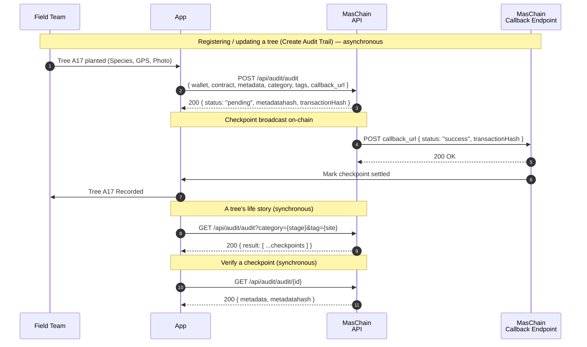

# Tree Tracker

Plant-a-tree campaigns are everywhere, but "we planted 10,000 trees" is easy to
claim and almost impossible to check. This guide builds a small Node.js app that
gives **every tree a tamper-proof life story** on-chain: where it was planted,
when, and a photo at each checkpoint — so a donor, an NGO, or a sceptical
classmate can verify the trees actually exist and are still growing.

## The Problem

Reforestation is a trust game. Donors fund trees they'll never see, and
"greenwashing" — claiming environmental impact that never happened — thrives on
that gap. If each tree carried a **timestamped, un-editable record** of its
planting and growth, the claim becomes checkable by anyone instead of taken on
faith.

An audit trail does exactly that. Each checkpoint stores a hash of the tree's
data on-chain with the exact time it was recorded. Edit a photo's caption or
backdate a planting later and the hash stops matching — **the fake is exposed**.

## What You'll Build

A minimal "tree tracker" backend that:

- Creates an **audit trail contract** once, at setup,
- Gives your field team a **wallet** that signs every checkpoint,
- **Registers** each tree with its species and GPS location,
- **Logs growth checkpoints** (height, photo hash, note) over months,
- Organises records with **categories** (planting stage) and **tags** (site),
- Shows the **full life story** of any single tree,
- **Verifies** each record against its on-chain hash,
- Receives the **asynchronous result** of each write on a callback URL.

## Services Used

- **[Audit Trail](../services/audit-trail/overview.md)** — record each tree's planting and growth as tamper-proof, timestamped entries.
- **[Wallet Management](../services/wallet-management/overview.md)** — create the wallet that signs your field records.

Here is the sequence we are building during this tutorial:



Writes (registering, checkpointing) are **asynchronous**: the API immediately
returns a `pending` hash plus the `metadatahash`, then POSTs the final
`success`/`failed` result to your `callback_url`. Reads return synchronously.

---

## Preparation

### 1. Subscribe and get your API keys

In the [Enterprise Portal](https://portal-testnet.maschain.com), subscribe to
**Audit Trail** and **Wallet Management**, then create an API key. You'll receive
a **`client_id`** and **`client_secret`** that authenticate every request. See
[Calling APIs](../general/calling_apis.md) and
[API Keys Generation](../portal/create-api-keys.md).

### 2. Create the Audit Trail Contract

Create an **Audit Trail smart contract** — the ledger every tree record is
written to. Keep `encrypt_data` as `false` so records stay publicly verifiable.
You receive a **`contract_address`**.

```js title="Create the audit contract (one-time)"
// POST /api/audit/contracts
{
  "name": "TreeTracker",
  "field": { "encrypt_data": false },
  "callback_url": "https://your.domain/callback"
}
```

The `contract_address` is confirmed on the `success` callback. See
[Audit Trail → Create Smart Contract](../services/audit-trail/audit-trail.md).

### 3. Set up the Project

You need Node.js 18+ (for the built-in `fetch`) and `bcryptjs` for the verify
step. Store credentials in an `.env` file — never hard-code them:

```bash title=".env"
MASCHAIN_API_URL=https://service-testnet.maschain.com
MASCHAIN_CLIENT_ID=your_client_id
MASCHAIN_CLIENT_SECRET=your_client_secret

# From step 2:
AUDIT_CONTRACT=0x<audit_contract_address>
# The field-team wallet that signs records (created below):
FIELD_WALLET=0x<field_wallet_address>
# Where MasChain POSTs async results:
CALLBACK_URL=https://your.domain/callback
```

```bash
npm install express dotenv bcryptjs
```

:::tip Testnet vs Mainnet
Use `https://service-testnet.maschain.com` while developing, and
`https://service.maschain.com` for production. Explore records at
[explorer-testnet.maschain.com](https://explorer-testnet.maschain.com).
:::

---

## MasChain Client

Every call shares the same base URL and auth headers, so wrap that once:

```js title="maschain.js"
const BASE_URL = process.env.MASCHAIN_API_URL;

const HEADERS = {
  client_id: process.env.MASCHAIN_CLIENT_ID,
  client_secret: process.env.MASCHAIN_CLIENT_SECRET,
  'content-type': 'application/json',
};

async function post(path, body) {
  const res = await fetch(`${BASE_URL}${path}`, {
    method: 'POST', headers: HEADERS, body: JSON.stringify(body),
  });
  const json = await res.json();
  if (json.status !== 200) throw new Error(`MasChain error: ${JSON.stringify(json)}`);
  return json.result;
}

async function get(path, params = {}) {
  const url = new URL(`${BASE_URL}${path}`);
  for (const [k, v] of Object.entries(params)) url.searchParams.set(k, v);
  const res = await fetch(url, { headers: HEADERS });
  const json = await res.json();
  if (json.status !== 200) throw new Error(`MasChain error: ${JSON.stringify(json)}`);
  return json.result;
}

module.exports = { post, get };
```

---

## 1. Create the Field Wallet

Create one wallet for your field team — it signs every tree record and appears as
the author (`from`) of each entry:

```js title="tree.js"
const { post, get } = require('./maschain');

// POST /api/wallet/create-user
async function createFieldWallet({ name, email, ic }) {
  const result = await post('/api/wallet/create-user', { name, email, ic });
  return result.wallet.wallet_address; // 0x...
}
```

Save the address as `FIELD_WALLET`. See
[Wallet Management → Create User Wallet](../services/wallet-management/wallet.md).

## 2. Set up Stages and Sites (one-time)

Use a **category** for the checkpoint stage and a **tag** for the planting site.
This is what lets you pull "every tree at Bukit Site" or "every 6-month check"
later:

```js title="tree.js"
// POST /api/audit/category  → { id, name, ... }
async function createCategory(name) {
  return (await post('/api/audit/category', { name })).id;
}
// POST /api/audit/tag  → { id, name, ... }
async function createTag(name) {
  return (await post('/api/audit/tag', { name })).id;
}
```

For example categories `Planted`, `6-Month Check`, `Verified`, and tags per site
like `bukit-site`. See
[Audit Category](../services/audit-trail/audit-category.md) and
[Audit Tags](../services/audit-trail/audit-tags.md).

## 3. Register or Checkpoint a Tree

The core action. Each record carries a stable **`tree_id`** as its `entity_id`,
so all checkpoints for one tree share an identity. Keep `metadata` a JSON string
so it hashes deterministically:

```js title="tree.js"
// POST /api/audit/audit
async function logTree({ treeId, stage, species, lat, lng, heightCm, photoHash, categoryId, tagIds }) {
  const metadata = JSON.stringify({
    entity_id: treeId,        // e.g. "A17" — same across every checkpoint
    stage,                    // "planted" | "6-month" | "verified"
    species, lat, lng, heightCm,
    photo_hash: photoHash,    // sha256 of the field photo (see tip below)
  });

  return post('/api/audit/audit', {
    wallet_address: process.env.FIELD_WALLET,
    contract_address: process.env.AUDIT_CONTRACT,
    metadata,
    category_id: categoryId ? [categoryId] : [],
    tag_id: tagIds || [],
    callback_url: process.env.CALLBACK_URL,
  });
}
```

```js title="Sample result (immediate)"
{
  "status": 200,
  "result": {
    "transactionHash": "0x76578bb22a17d1fa06165570...",
    "status": "pending",
    "metadatahash": "$2y$12$JCdgqkB1QKI5cRHTVaQXqu2JZPMj5MH8qT6GU7vb0NR4ONjgR1i62",
    "metadata": "{\"entity_id\":\"A17\",\"stage\":\"planted\",...}"
  }
}
```

:::tip Attaching the actual photo
This example stores a **hash** of the field photo (cheap and enough to prove the
image wasn't swapped). To store the photo itself on-chain, send the request as
`multipart/form-data` with a `file` field — see the
[Audit Trail reference](../services/audit-trail/audit-trail.md).
:::

## 4. Show a Tree's Life Story

Reads are synchronous. Pull every checkpoint for a stage/site, then group by
`entity_id` to reconstruct each tree's timeline:

```js title="tree.js"
// GET /api/audit/audit?category={id}&tag={id}
async function getTreeHistory({ categoryId, tagId } = {}) {
  const params = {};
  if (categoryId) params.category = categoryId;
  if (tagId) params.tag = tagId;
  return get('/api/audit/audit', params);
}
```

Each record includes its `metadata`, `transactionHash`, and `created_at` — the
un-editable proof of *when* that tree was seen alive.

## 5. Verify a Checkpoint

The payoff. Fetch a record and check its `metadata` against the on-chain
`metadatahash`. A match proves the record is exactly what was committed in the
field:

```js title="tree.js"
const bcrypt = require('bcryptjs');

// GET /api/audit/audit/{id}
async function verifyRecord(id) {
  const entry = await get(`/api/audit/audit/${id}`);
  return { id, untampered: bcrypt.compareSync(entry.metadata, entry.metadatahash) };
}
```

Change one digit of a stored GPS coordinate and re-run — `untampered` flips to
`false`. Anyone can reproduce that check, which is what makes the campaign
trustworthy.

## 6. Receive Async Result (Callback)

Writes finish out-of-band. Stand up an endpoint at your `CALLBACK_URL` to confirm
each checkpoint actually landed on-chain before you show it publicly:

```js title="callback-server.js"
const express = require('express');
const app = express();
app.use(express.json());

app.post('/callback', (req, res) => {
  const { status, transactionHash } = req.body;
  if (status === 'success') {
    console.log(`✅ ${transactionHash} confirmed`);
  } else {
    console.log(`❌ ${transactionHash} failed: ${req.body.message}`);
  }
  res.sendStatus(200);
});

app.listen(3000, () => console.log('Listening for MasChain callbacks on :3000'));
```

:::warning Publish a tree only on `success`
The immediate response is only `pending`. Wait for the `success` callback before
treating a checkpoint as recorded. On `failed`, don't publish it — retry.
:::

---

## Putting It Together

```js title="demo.js"
require('dotenv').config();
const { createCategory, createTag, logTree, getTreeHistory, verifyRecord } = require('./tree');

(async () => {
  // One-time setup
  const planted = await createCategory('Planted');
  const site = await createTag('bukit-site');

  // Register a new tree
  const entry = await logTree({
    treeId: 'A17', stage: 'planted', species: 'Meranti',
    lat: 3.1390, lng: 101.6869, heightCm: 30,
    photoHash: 'sha256-…', categoryId: planted, tagIds: [site],
  });
  console.log('Recorded (pending):', entry.transactionHash);

  // ...after the success callback, pull the site's trees
  const history = await getTreeHistory({ tagId: site });
  console.log(`Records at site: ${history.length}`);
})();
```

Run it:

```bash
node demo.js
```

Watch each checkpoint confirm in the
[MasChain Explorer](https://explorer-testnet.maschain.com). When a donor asks
"are the trees real?", you hand them a link, not a promise.

## Next steps

- [Audit Trail Overview](../services/audit-trail/overview.md)
- [Audit Trail Reference](../services/audit-trail/audit-trail.md) — full request/response and callback details
- [Audit Category](../services/audit-trail/audit-category.md) and [Audit Tags](../services/audit-trail/audit-tags.md)
- [Wallet Management Overview](../services/wallet-management/overview.md)
- [Calling APIs](../general/calling_apis.md) — authentication basics
