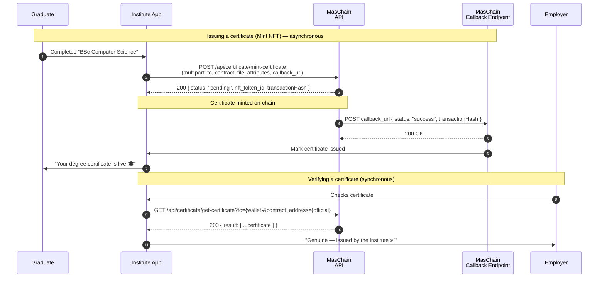

# University Certificate

Universities, bootcamps, and training centres hand out certificates every year —
and every year some of them get faked. A student edits a PDF, changes a name and
a grade, and an employer has no easy way to tell. This guide builds a small
Node.js app that lets an institute issue each certificate as a **tamper-proof
NFT** and lets *anyone* — a recruiter, another university, the student
themselves — verify it in seconds.

## The Problem

A paper or PDF certificate is trusted because of how it *looks* — a logo, a
signature, a fancy border. But looks are easy to copy. To really check a
certificate today, an employer has to email the institute and wait for someone
to dig through records. Most never bother, so fakes slip through.

A **non-fungible token (NFT)** solves this by moving the proof onto a public
blockchain:

- The institute is the **only** party allowed to issue certificates (one
  authorised wallet mints them).
- Each certificate is **unique** and **owned by the graduate's wallet** — it
  can't be duplicated or silently edited.
- The details (name, programme, grade, date) live on-chain as **attributes**
  that anyone can read and check independently — no phone calls, no waiting.

If a certificate isn't on the chain under the institute's official contract,
it's fake. That's the whole idea.

## What You'll Build

A minimal "certificate authority" backend that:

- Creates one **NFT contract** for your institute, at setup,
- Gives each graduate a **wallet** to hold their certificates,
- **Issues** a certificate NFT with the diploma image and the graduate's details,
- Lets anyone **verify** a certificate against the official contract,
- Receives the **asynchronous result** of each issue on a callback URL.

## Services Used

- **[Certificate (NFT)](../services/certificate/overview.md)** — Issue each diploma as a unique, verifiable NFT.
- **[Wallet Management](../services/wallet-management/overview.md)** — Give each graduate a wallet to hold their certificates.

Here is the sequence we are building during this tutorial:



Issuing is **asynchronous**: the API returns a `pending` result with the
`nft_token_id` immediately, then POSTs the final `success`/`failed` result to your
`callback_url`. Verification reads return synchronously.

---

## Preparation

### 1. Subscribe and get your API keys

In the [Enterprise Portal](https://portal-testnet.maschain.com), subscribe to
**Certificate** and **Wallet Management**, then create an API key for your
**`client_id`** and **`client_secret`**. See
[Calling APIs](../general/calling_apis.md) and
[API Keys Generation](../portal/create-api-keys.md).

### 2. Create the Certificate NFT Contract

Create an **NFT smart contract** for your institute — this is the official
collection your certificates belong to. The `wallet_address_owner` you set is the
**only wallet allowed to mint**, so use a wallet the institute controls and keeps
safe. You receive a **`contract_address`**.

:::info This contract address *is* your reputation
Publish it on your official website. Anyone verifying a certificate should check
it was issued under *this exact* contract. A certificate under any other contract
— even one with your institute's name — is not yours.
:::

```js title="Create the NFT contract (one-time)"
// POST /api/certificate/create-smartcontract
{
  "wallet_address": "0x<owner_wallet>",      // deploys the contract
  "name": "SxnwayUniversityCerts",           // contract nickname
  "field": {
    "wallet_address_owner": "0x<owner_wallet>", // ONLY this wallet can issue
    "max_supply": 0,                            // 0 = unlimited
    "name": "Sxnway University Certificate",
    "symbol": "SXNCERT"
  },
  "callback_url": "https://your.domain/callback"
}
```

The `contract_address` is confirmed on the `success` callback. See
[Certificate → Create Smart Contract](../services/certificate/certificate-service.md)
and [Smart Contract Creation](../portal/create-smart-contract.md).

### 3. Set up the Project

Node.js 18+ (for the built-in `fetch`, `FormData`, and `Blob`). Keep credentials
in `.env`:

```bash title=".env"
MASCHAIN_API_URL=https://service-testnet.maschain.com
MASCHAIN_CLIENT_ID=your_client_id
MASCHAIN_CLIENT_SECRET=your_client_secret

# From step 2:
CERT_CONTRACT=0x<nft_contract_address>
# The contract owner — the only wallet allowed to issue certificates:
OWNER_WALLET=0x<owner_wallet>
# Where MasChain POSTs async results:
CALLBACK_URL=https://your.domain/callback
```

```bash
npm install express dotenv
```

:::tip Testnet vs Mainnet
Develop on `https://service-testnet.maschain.com`; switch to
`https://service.maschain.com` for production. View issued certificates at
[explorer-testnet.maschain.com](https://explorer-testnet.maschain.com).
:::

---

## MasChain Client

Reads and the contract call use JSON; issuing a certificate uploads a file, so it
needs a `multipart/form-data` helper. Note the form helper does **not** set a
`content-type` — `fetch` sets the multipart boundary automatically:

```js title="maschain.js"
const fs = require('fs');
const BASE_URL = process.env.MASCHAIN_API_URL;

const AUTH = {
  client_id: process.env.MASCHAIN_CLIENT_ID,
  client_secret: process.env.MASCHAIN_CLIENT_SECRET,
};

async function post(path, body) {
  const res = await fetch(`${BASE_URL}${path}`, {
    method: 'POST',
    headers: { ...AUTH, 'content-type': 'application/json' },
    body: JSON.stringify(body),
  });
  const json = await res.json();
  if (json.status !== 200) throw new Error(`MasChain error: ${JSON.stringify(json)}`);
  return json.result;
}

// multipart/form-data POST — for endpoints that upload a file.
async function postForm(path, fields, filePath) {
  const form = new FormData();
  for (const [k, v] of Object.entries(fields)) form.set(k, v);
  const bytes = fs.readFileSync(filePath);
  form.set('file', new Blob([bytes]), filePath.split('/').pop());

  const res = await fetch(`${BASE_URL}${path}`, { method: 'POST', headers: AUTH, body: form });
  const json = await res.json();
  if (json.status !== 200) throw new Error(`MasChain error: ${JSON.stringify(json)}`);
  return json.result;
}

async function get(path, params = {}) {
  const url = new URL(`${BASE_URL}${path}`);
  for (const [k, v] of Object.entries(params)) url.searchParams.set(k, v);
  const res = await fetch(url, { headers: AUTH });
  const json = await res.json();
  if (json.status !== 200) throw new Error(`MasChain error: ${JSON.stringify(json)}`);
  return json.result;
}

module.exports = { post, postForm, get };
```

---

## 1. Give Each Graduate a Wallet

Each graduate needs a wallet to receive and hold their certificates. The returned
**`wallet_address`** is where their NFTs live — and, later, the address an
employer verifies against:

```js title="certs.js"
const { post, postForm, get } = require('./maschain');

// POST /api/wallet/create-user
async function createGraduateWallet({ name, email, ic }) {
  const result = await post('/api/wallet/create-user', { name, email, ic });
  return result.wallet.wallet_address; // 0x...
}
```

See [Wallet Management → Create User Wallet](../services/wallet-management/wallet.md).

## 2. Issue a Certificate

The core action. Issue (mint) from the **institute's owner wallet** to the
graduate's wallet, attaching the certificate image and the graduate's details as
`attributes`. Issuing is a file upload, so use the `postForm` helper:

```js title="certs.js"
// POST /api/certificate/mint-certificate  (multipart/form-data)
async function issueCertificate({ graduateWallet, title, description, attributes, imagePath }) {
  return postForm('/api/certificate/mint-certificate', {
    wallet_address: process.env.OWNER_WALLET,     // must be the contract owner
    to: graduateWallet,                           // graduate receiving the certificate
    contract_address: process.env.CERT_CONTRACT,
    name: title,                                  // "BSc Computer Science"
    description,
    attributes: JSON.stringify(attributes),       // the graduate's details
    callback_url: process.env.CALLBACK_URL,
  }, imagePath);
}
```

```js title="Sample result (immediate)"
{
  "status": 200,
  "result": {
    "nft_token_id": 42,
    "transactionHash": "0xf519ba69ba0e603583e0e885786f5ad1...",
    "receiver_wallet_address": "0x147f20a28739da15419AdC0...",
    "certificate": "https://storage.maschain.com/.../metadata/42.json",
    "certificate_image": "https://storage.maschain.com/.../image/diploma.png",
    "status": "pending"
  }
}
```

The `attributes` are the facts an employer will check — keep them clear and
consistent:

```js title="attributes example"
[
  { "trait": "Student Name", "value": "Nur Aisyah binti Rahman" },
  { "trait": "Programme", "value": "BSc (Hons) Computer Science" },
  { "trait": "Classification", "value": "First Class" },
  { "trait": "Graduation Year", "value": "2026" }
]
```

For larger diploma scans, use `mint-certificate-small` / `-medium` / `-large`
(up to 10 / 30 / 100 MB). See
[Certificate → Mint NFT](../services/certificate/certificate-service.md).

## 3. Verify a Certificate (the anti-fake part)

This is what makes the whole thing worthwhile. Anyone can check a certificate by
reading it back from the chain — no login, no phone call. Reads are synchronous.

Two things have to be true for a certificate to be genuine:

1. It exists **under the institute's official contract** (`CERT_CONTRACT`), and
2. It's owned by the wallet that claims it.

```js title="certs.js"
// GET /api/certificate/get-certificate
async function verifyCertificate({ graduateWallet, nftId }) {
  const certs = await get('/api/certificate/get-certificate', {
    to: graduateWallet,
    contract_address: process.env.CERT_CONTRACT, // the OFFICIAL contract only
    status: 'success',
  });

  const match = certs.find((c) => c.nft_token_id === nftId);
  if (!match) return { genuine: false };

  return {
    genuine: true,
    issuedBy: process.env.CERT_CONTRACT,
    transactionHash: match.transactionHash,
    metadata: match.certificate_file, // metadata file holding the details (name, programme, grade)
  };
}
```

Because we query using the **institute's own contract address**, a doctored PDF
or a certificate minted under some other contract simply won't be found —
`genuine: false`. There's nothing to argue about: it either exists on the
institute's chain or it doesn't.

:::tip Make it public
Publish a tiny verification page — an employer pastes in the graduate's wallet
address and certificate number, and your app calls `verifyCertificate` and shows
a green tick or a red cross. That single page replaces a mountain of "please
confirm this graduate" emails.
:::

## 4. Receive Async Result (Callback)

Issuing finishes out-of-band. Stand up an endpoint at your `CALLBACK_URL` to
confirm the certificate actually minted before telling the graduate:

```js title="callback-server.js"
const express = require('express');
const app = express();
app.use(express.json());

app.post('/callback', (req, res) => {
  const { status, transactionHash } = req.body.result || req.body;
  if (status === 'success') {
    console.log(`${transactionHash} confirmed — certificate issued`);
  } else {
    console.log(`${transactionHash} failed: ${req.body.result?.message}`);
  }
  res.sendStatus(200);
});

app.listen(3000, () => console.log('Listening for MasChain callbacks on :3000'));
```

:::warning Announce a certificate only on `success`
The immediate response is only `pending`. Wait for the `success` callback before
telling the graduate their certificate is live. On `failed`, don't announce it —
retry.
:::

---

## Putting It Together

```js title="demo.js"
require('dotenv').config();
const { createGraduateWallet, issueCertificate, verifyCertificate } = require('./certs');

(async () => {
  // Onboard a graduate
  const wallet = await createGraduateWallet({
    name: 'Nur Aisyah', email: 'aisyah@example.com', ic: '040101-01-1234',
  });
  console.log('Graduate wallet:', wallet);

  // Issue their degree certificate
  const cert = await issueCertificate({
    graduateWallet: wallet,
    title: 'BSc (Hons) Computer Science',
    description: 'Awarded by Sxnway University, 2026.',
    attributes: [
      { trait: 'Student Name', value: 'Nur Aisyah binti Rahman' },
      { trait: 'Programme', value: 'BSc (Hons) Computer Science' },
      { trait: 'Classification', value: 'First Class' },
      { trait: 'Graduation Year', value: '2026' },
    ],
    imagePath: './diploma.png',
  });
  console.log('Issued (pending):', cert.nft_token_id);

  // ...after the success callback, anyone can verify it
  console.log('Verify:', await verifyCertificate({
    graduateWallet: wallet,
    nftId: cert.nft_token_id,
  }));
})();
```

Run it:

```bash
node demo.js
```

Watch each certificate mint in the
[MasChain Explorer](https://explorer-testnet.maschain.com), and your
`callback-server.js` log the `success` result. Graduates walk away with a
credential they truly own — and one no employer ever has to take on faith.

## Next steps

- [Certificate (NFT) Overview](../services/certificate/overview.md)
- [Certificate Service Reference](../services/certificate/certificate-service.md) — full request/response and callback details
- [Wallet Management Overview](../services/wallet-management/overview.md)
- [Calling APIs](../general/calling_apis.md) — authentication basics
